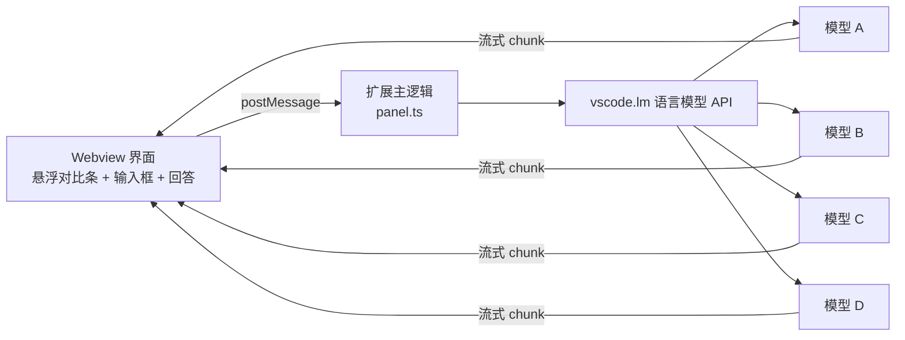
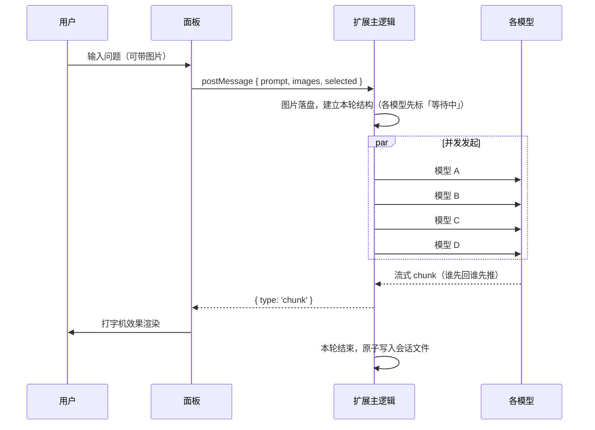

# 多模型对比对话 · Multi-Model Compare

> 在 VS Code 的独立面板里，把**同一个问题同时发给多个大模型**，流式并排对比它们的回答 ——
> 支持多轮追问、图片输入与本地历史。


**为什么用它**

- **一次提问，多家并发** —— `Promise.all` 同时发起，各模型独立流式输出，互不阻塞；
- **换个角度看答案** —— 点模型名**单读**、勾复选框**横向并排**、点选项卡逐轮切换；
- **上下文各管各的** —— 每个模型只回放自己答完的历史轮次，互不串扰，方便交叉验证；
- **零运行时依赖** —— 不引入任何运行时 npm 包，界面跟随 VS Code 主题变量；
- **不碰你的密钥** —— 复用你本机已配置好的模型（Copilot 订阅或自定义端点），扩展**不接触任何 API Key**；
- **数据留在本地** —— 会话与图片都存在 VS Code `globalStorage` 里，不上传、不同步。

当前版本 **`v0.8.0`** ｜ 需求文档：[`docs/多模型对比对话插件需求文档.md`](docs/多模型对比对话插件需求文档.md)

---

## 快速安装

| 前置条件 | 要求 |
|----------|------|
| VS Code | **≥ 1.137.0**（`vscode.lm` 稳定 API 所需） |
| Node.js | 18+（仅「从源码安装」与开发时需要，本项目在 v24 上验证） |
| 模型 | 本机已配好至少一个可用模型：Copilot 订阅，或在 `chatLanguageModels.json` 里注册的自定义端点 |

从源码安装（日常使用）：

```bash
git clone https://github.com/CrazyGoudanli/VsCode_ModleEvaluation.git
cd VsCode_ModleEvaluation
npm install
npm run install:local
```

装完后**完全退出并重启 VS Code**（macOS `Cmd+Q`），再按 `Cmd+Shift+P` 执行
**`多模型对比: 打开对比对话面板`**。

> 不想克隆源码？也可以安装打包好的 `.vsix`，或按 `F5` 起一个调试宿主 ——
> 详见 [安装](#安装) 里的三种方式。

## 目录

- [快速上手](#快速上手)
- [使用说明](#使用说明)
- [特性](#特性)
- [设置项](#设置项)
- [工作原理](#工作原理)
- [数据存储](#数据存储)
- [安装](#安装)
- [开发](#开发)
- [项目结构](#项目结构)
- [已知限制与设计取舍](#已知限制与设计取舍)
- [排障](#排障)
- [版本历史](#版本历史)
- [后续可做](#后续可做)
- [贡献](#贡献)
- [许可](#许可)

> 本文快捷键以 **macOS** 为例；Windows / Linux 把 `Cmd` 换成 `Ctrl` 即可，
> 存储与日志路径见 [数据存储](#数据存储) 与 [排障](#排障)。

## 快速上手

如果扩展**已经装好**了，只要两步：

1. 按 `Cmd+Shift+P` 打开命令面板
2. 执行 **`多模型对比: 打开对比对话面板`**

顶部悬浮条里每个模型右侧都有一个开关（控制是否提问），打开后就可以在底部输入问题、回车发送。
拿到回答后，想横向比一比，就勾上卡片**左侧的复选框**。

## 使用说明

### 界面布局

```
┌──────────────────────────────────────────────────────────────────────┐
│ 多模型对比对话  快速排序                          [新建会话] [历史]  │
├──────────────────────────────────────────────────────────────────────┤
│ ☐ ● Sol   2.1s   (o)  ☑ ● Astra  生成中 (o)  ☐ ● Flash  4.8s  (o)   │
│ ↑左：勾上=并排对比           ↑中：点名字=单读它      ↑右：是否提问    │
│ （上面这条半透明悬浮，内容从它下面滚过去）                         │
├──────────────────────────────────────────────────────────────────────┤
│ 第 1 轮  09-11 21:23  3 个模型 · 3 成功                             │
│                                                                      │
│ ┃ 你的提问                                                            │
│ ┃ 解释一下快速排序                                                    │
│                                                                      │
│ ● Sol 4.8s │ Astra 6.2s │ Flash 生成中   ← 本轮选项卡                  │
│ ──────────────────────────────────────────────────────────────────── │
│ 模型回答（本图是并排对比状态，勾了两个）                             │
│ ┌─ ● Sol    完成·4.8s 复制 导入… ─┐ ┌─ ● Astra  完成·6.2s 复制 导入… ─┐ │
│ │ 快速排序是分治算法……           │ │ 它把数组分成两部分……           │ │
│ │ （超出时格子内部纵向滚动）     │ │                                │ │
│ └────────────────────────────────┘ └────────────────────────────────┘ │
├────────────────────────────────────────────┬─────────────────────────┤
│ 输入问题…                       [发送] [停止]│ 历史会话                │
└────────────────────────────────────────────┴─────────────────────────┘
```

| 区域 | 位置 | 作用 |
|------|------|------|
| 工具栏 | 顶部 | 会话标题、新建会话、收起/展开历史 |
| **模型控制条** | 消息区**顶部悬浮** | 每个模型一个小卡，上面有三个可操作的地方（见下） |
| 消息区 | 中部 | 一轮一条提问 + 当前要看的那一个/几个模型的回答 |
| 历史会话 | 右侧 | 历史列表，点开可恢复并继续追问 |
| 输入区 | 底部 | 输入框 + 发送 / 停止（两者等高） |

### 悬浮条卡片上的三个位置

一张迷你卡上有**三个互不干扰**的控件（卡片上只留模型名与耗时/状态，不再有多余文案）：

| 位置 | 控件 | 管什么 | 效果 |
|------|------|--------|------|
| **左** | 复选框 | **怎么看** | 勾选 → 该模型参与**并排对比**；勾几个就并排显示几个 |
| **中** | 模型名（点一下） | **看谁** | 点击 → 退出并排，**只读这一个**模型的整个会话 |
| **右** | 开关 | **问不问它** | 打开 → 它参与提问；关闭 → 不再问它 |

> 三者的职责刻意分开：
> - “并排对比”只影响展示，**不影响**是否向它提问；
> - “是否提问”只影响新问题发给谁，**不影响**能不能看它已有回答（关掉后仍然可以点开看）；
> - 回答卡片上的**模型名**也可以点，效果同“中”（退出并排、单读它）。

**并排对比时**：

- 每一轮都把勾选的模型横向排开，**等宽均分**；放不下时横向滚动（每格最小 260px）；
- 每格保留完整结构：标题栏（状态点 + 模型名 + 状态 + 复制 / 重新生成 / 导入）+ Markdown 正文；
- 各格**等高**，内容超出时**格内纵向滚动**（上限 60vh），便于逐条对照；
- 某模型在某一轮没被提问时，会保留一格虚线占位“本轮未向该模型提问”，不会让各轮列出的模型数量对不上。

**如何退出并排对比**：

- 把左侧复选框**全部取消** → 回到单模型阅读；
- 或点某个模型的**卡片正文 / 回答卡上的模型名** → 直接切到只读它。

**怎么一眼分清"我说的话"和"模型答的话"**：

- 提问总是带「**你的提问**」标签，并且有主题色底纹 + 左侧色条；
- 模型回答前面有「**模型回答**」小标题与分隔线打头（并排对比时专略，因为每格自带标题栏）。

### 操作方式

| 操作 | 方式 |
|------|------|
| 发送问题 | 回车 |
| 换行 | `Shift` + 回车 |
| 给模型发图片 | `Cmd+V` 粘贴，或直接把图片拖进输入区 |
| 中断生成 | 点「停止」 |
| **选出要对比的模型** | 勾选悬浮条卡片**左侧的复选框**（可多选，勾几个就并排几个） |
| **回到单模型阅读** | 把左侧复选框全部取消，或点某模型的卡片正文 / 回答卡上的模型名 |
| **选要提问的模型** | 打开 / 关掉模型卡片**右侧的开关** |
| **读另一个模型的回答** | 点该轮顶部的模型选项卡，或点悬浮条卡片上的模型名 |
| **复制某条回答** | 点该回答标题栏的「复制」（复制的是 Markdown 原文） |
| **重新生成某条回答** | 最新一轮回答完成后，点对应标题栏的「重新生成」 |
| **编辑刚才的提问** | 点最新一轮提问右上角的「编辑」，改完选「仅保存」或「保存并重新生成」 |
| **交给 Copilot 继续聊** | 点「导入单条」（这一条）或「导入本组」（该模型的整段对话） |
| 放大图片 | 点缩略图；再点一下或按 `Esc` 关闭 |
| 打开回答里的链接 | 直接点击，会用系统浏览器打开 |
| 切换历史侧栏 | 点「历史」，或 `Cmd+Shift+P` → `多模型对比: 显示 / 隐藏历史会话` |
| 新建会话 | 点「新建会话」 |
| 删除历史会话 | 点会话右侧 `✕`，再点一次变成的「确认」（两段式，防误触） |

### 编辑已发送的提问

最新一轮提问的右上角有一个「编辑」按钮（其它轮次没有 —— 改写历史轮会让后续上下文自相矛盾）。点开后可直接改文字：

| 按钮 | 行为 |
|------|------|
| **仅保存** | 只改提问文字，不动已经拿到的回答（适合修正错别字） |
| **保存并重新生成** | 用新提问**重新问本轮原有的那几个模型**（不受之后开关变化影响），清空重出 |
| **取消** / `Esc` | 放弃修改 |

- `Cmd` / `Ctrl` + 回车 = 保存并重新生成；
- 生成过程中不能编辑（按钮置灰），点「停止」或等完成即可；
- 带图片的轮次**只能改文字，图片原样保留**；
- 改过的提问会带一个「已编辑」小标记；
- 改的是第一轮时会话标题跟着更新；若那一轮被设为共享上下文，上下文会自动解除（回答已经变了）。

### 怎么读懂每格回答

标题栏：`● 模型名　状态 · 耗时　[复制] [重新生成] [导入单条] [导入本组]`
（最前面的圆点就是下面的状态，模型还会有一个固定的识别色，选项卡 / 悬浮条同色）

| 状态 | 含义 |
|------|------|
| 等待中 | 已排队，尚未开始 |
| 生成中 | 正在流式输出 |
| 完成 | 正常结束，后面跟着本次耗时（如 `完成 · 3.2s`） |
| 失败 | 出错，底部会显示错误码与处理建议 |
| 已取消 | 点了「停止」后中断 |

若某张卡片下方出现 **“该模型不支持图片，本次已仅发送文本”**，说明这个模型收不了图片，
扩展已自动去掉图片重试并成功了。

## 特性

| 能力 | 说明 |
|------|------|
| **并排对比** | 悬浮条卡片左侧一个复选框，勾选多个模型即可在会话区**横向并排**它们的回答，逐条对照；每轮都并排 |
| **等宽 + 横向滚动** | 并排时每格等宽均分，放不下就横向滚动（每格最小 260px）；各格等高，内容超出时格内滚动 |
| **缺席占位** | 某模型在某轮没被提问时，保留一格虚线占位，各轮列出的模型始终一致 |
| **开关 = 参与提问** | 悬停条卡片右侧一个开关，控制是否向它提问；开关状态写入会话，下次打开保持 |
| **点卡片 = 单读它** | 点卡片正文（或回答卡上的模型名）即退出并排，整个会话切到只读这个模型 |
| **空会话也能选模型** | 还没提问时悬浮条就列出**你自己添加的**模型，先选后发（此时左复选框置灰） |
| **提问可编辑** | 最新一轮的提问可就地编辑（提问区右上角「编辑」），可选「仅保存」或「保存并重新生成」；生成中自动置灰 |
| **顶部悬浮控制条** | 半透明 + 毛玻璃，内容从它下面滚过，不占对话区横向空间；卡片上只留模型名与状态 |
| 逐轮选项卡 | 每一轮顶部列出本轮参与的模型与各自状态，点一下切换，整个会话跟着切 |
| **模型识别色** | 每个模型一个固定颜色（取主题图表色），选项卡、标题栏、悬浮条一致 |
| 并发流式 | `Promise.all` 同时发起，各模型独立打字机输出，互不阻塞 |
| 上下文隔离 | 每个模型只回放**自己**答完的历史轮次，互不串扰 |
| **Markdown 渲染** | 标题、列表（含嵌套）、表格、代码块、引用、链接、分隔线、粗体/斜体/删除线 |
| **一键复制** | 每条回答标题栏的复制按钮，复制 Markdown 原文，带「已复制」反馈 |
| **交给 Copilot 续聊** | 「导入单条 / 导入本组」把回答写成上下文文件并复制引用 |
| 图片输入 | 支持粘贴 / 拖入图片，最多 4 张、单张 ≤ 20MB |
| 历史会话 | 自动保存到本地，侧栏可点开恢复并继续追问 |
| 密钥安全 | 复用 VS Code 已配置的模型，扩展**不接触任何 API Key** |
| 容错 | 单个模型失败 / 超时 / 取消，不影响其它回答 |
| 错误友好 | `NoPermissions` / `Blocked` / `NotFound` 会给出中文处理建议 |
| 同名区分 | 不同 vendor 下的同名模型会自动补上 vendor 后缀 |

## 设置项

| 设置 | 默认值 | 说明 |
|------|--------|------|
| `multiModelCompare.preferredVendors` | `["customendpoint"]` | 「我的模型」的范围 —— 默认就是你自己在 `chatLanguageModels.json` 里添加的模型 |
| `multiModelCompare.onlyPreferredVendors` | `true` | 只显示上面白名单里的模型；**关掉就会列出全部可用模型**（含 Copilot 自带的） |
| `multiModelCompare.maxSelectedModels` | `8` | 默认勾选参与提问的模型数量上限，`0` 表示不限制 |

在设置界面搜索 `multiModelCompare` 即可找到，改完立即生效（不用重开面板）。

> **默认范围**：打开面板时**只列出你自己添加的模型**（vendor = `customendpoint`），
> 并默认全选（受 `maxSelectedModels` 上限约束），所以第一次打开就能直接提问。
> 模型名**完整显示、不截断**：卡片宽度跟着名字走，一行放不下时悬浮条横向滚动。
> 之后每次改动悬浮条上的开关都会写进会话文件，下次打开这个会话时恢复。
>
> 想连 Copilot 自带的模型一起看，把 `multiModelCompare.onlyPreferredVendors` 关掉
> （或在 `preferredVendors` 里加上别的 vendor 名）。如果系统里模型很多、
> 又不想一次并发打到太多，就把 `maxSelectedModels` 调小 —— 并发打太多模型
> 既费额度又容易触发限流。

## 工作原理



扩展**不自己解析** `chatLanguageModels.json`、**不硬编码** API Key，而是通过 VS Code 的
Language Model API（`vscode.lm`）读取本机已配置的模型（含 `chatLanguageModels.json`
里注册的自定义端点）。

这带来三个好处：

1. **不用管密钥** —— 直接用 VS Code 已有的登录态与模型配置；
2. **不用写各家的协议适配** —— 自定义端点、Copilot 原生模型同一套代码；
3. **自动拿到流式输出** —— `response.text` 本身就是 `AsyncIterable<string>`。

一次提问的完整流程：



## 数据存储

会话与图片存在 VS Code 的全局存储目录下，**不在项目里**：

```
<VS Code globalStorage>/local.multi-model-compare/
├── sessions/<sessionId>.json   每个会话一个文件（先写 .tmp 再 rename，原子写入）
├── images/<uuid>.<ext>         图片二进制，被会话文件按文件名引用
└── contexts/                   未打开工作区时，「导入到 Copilot」的上下文文件写这里
```

各平台的完整路径：

| 平台 | 路径 |
|------|------|
| macOS | `~/Library/Application Support/Code/User/globalStorage/local.multi-model-compare/` |
| Windows | `%APPDATA%\Code\User\globalStorage\local.multi-model-compare\` |
| Linux | `~/.config/Code/User/globalStorage/local.multi-model-compare/` |

> 会话文件里**只存图片文件名**，不存 base64，避免文件膨胀。
> 扩展启动时会清理没被任何会话引用的孤儿图片。
>
> **「导入单条 / 导入本组」**会在当前工作区根目录写一个 `.multi-model-context/` 文件夹
> （每个模型一个 `.md`），并把文件引用复制到剪贴板，方便在 Copilot Chat 里用 `#` 引用；
> 未打开工作区时改写到上面的 `contexts/`。该目录是纯本地产物，可随时删除，已在 `.gitignore` 里。
>
> 旧版本留下的 `settings.json`（卡片宽度等）在 v0.4.0 后不再使用，
> 留在那里不影响任何东西，可以手动删掉。

## 安装

有三种方式，按使用场景选：

### 方式一：本地安装（推荐，日常使用）

> 首次使用需要先克隆仓库并安装开发依赖，见上方 [快速安装](#快速安装)。

```bash
npm run install:local
```

先编译，再把运行期需要的文件（`package.json` / `out` / `media` / `README.md` / `LICENSE`，约 **170K**）
复制到 `~/.vscode/extensions/local.multi-model-compare-<version>/`。**无需下载任何东西。**

**装完之后必须完全退出并重启 VS Code**（`Cmd+Q` 再打开），扩展才会被加载。

之后就能在**任何窗口**里直接用。

改代码后重新生效：

```bash
npm run install:local                        # 重新编译 + 覆盖安装
```

再按 `Cmd+Shift+P` → `Developer: Reload Window` 即可。

**升级到新版本**：

```bash
npm run install:local   # 会自动移除旧版本目录，安装当前版本
```

然后 `Cmd+Q` 重启 VS Code。已保存的历史会话与开关选择**不会丢失** ——
它们存在 `globalStorage` 里，不随扩展目录变化。

卸载：

```bash
npm run uninstall:local
```

### 方式二：F5 调试宿主（开发阶段）

按 **F5**，选择「运行扩展（多模型对比对话）」。会弹出一个新的 VS Code 窗口
（标题带 `[扩展开发宿主]`），扩展装在里面。

> 这个窗口是**临时的**，关掉就没了，适合改代码时快速验证。

### 方式三：打包 .vsix（发给别人）

```bash
npm run package:vsix
```

会在 `dist/` 下生成两个文件：

| 文件 | 用途 |
|------|------|
| `multi-model-compare-<version>.vsix` | 扩展安装包（约 **47 KB**），发给对方 |
| `安装说明（先看这个）.md` | 面向非技术用户的图文说明，一起发 |

对方拿到后，任选一种安装：

- **双击** `.vsix` 文件
- 或在扩展面板右上角「···」→「从 VSIX 安装…」
- 或命令行 `code --install-extension multi-model-compare-<version>.vsix`

> **打包是零下载的**：`scripts/package-vsix.mjs` 直接手工构造 vsix
> （本质是个特定结构的 zip：`[Content_Types].xml` + `extension.vsixmanifest` + `extension/`）。
> 因此**不需要** `npx @vscode/vsce`（那个会下载几十 MB 的 npm 依赖），也不需要联网。

#### ⚠️ 发给别人前要知道的两件事

1. **对方必须自己配置模型**。扩展里**不包含**任何账号或 API Key ——
   它借用的是使用者自己 VS Code 里配好的模型（Copilot 订阅，或自定义端点）。
   对方没配的话，打开面板会提示「没有找到可用模型」。
   这一点已经在 `安装说明（先看这个）.md` 里写清楚了。
2. **对方的 VS Code 需要 ≥ 1.137.0**（`vscode.lm` 稳定 API 的要求）。
   版本不够时安装会提示不兼容。

### 三种方式对比

| | F5 调试宿主 | `install:local` | `.vsix` |
|---|---|---|---|
| 重启 VS Code 后还在 | ❌ 关掉就没了 | ✅ 一直在 | ✅ 一直在 |
| 改代码生效 | 重载窗口 | 重跑脚本 + 重载窗口 | 重新打包再装 |
| 需要下载 | 不需要 | 不需要 | 不需要 |
| 适合 | 开发调试 | **日常使用（自己）** | **分享给他人** |
| 会写入扩展清单 | 否 | 否 | 是（在扩展面板可见） |

> 安装脚本只会操作 `local.multi-model-compare-*` 这个前缀的目录，不会影响已安装的其它扩展。

## 开发

```bash
git clone https://github.com/CrazyGoudanli/VsCode_ModleEvaluation.git
cd VsCode_ModleEvaluation
npm install           # 只装 devDependencies（无运行时依赖）

npm run compile       # 一次性编译
npm run watch         # 监听文件变化自动编译
npm test              # 离线冒烟测试（70 项断言）
npm run install:local # 编译 + 装到本机 ~/.vscode/extensions
npm run package:vsix  # 编译 + 打包 dist/*.vsix（零下载）
```

### 可用命令

在命令面板（`Cmd+Shift+P`）里搜索「多模型对比」：

| 命令 | 作用 |
|------|------|
| `多模型对比: 打开对比对话面板` | 打开主面板 |
| `多模型对比: 新建会话` | 清空当前会话重新开始 |
| `多模型对比: 显示 / 隐藏历史会话` | 切换**右侧**历史侧栏 |

### 测试

`npm test` 会先编译（`pretest`），再跑两个套件：

**`scripts/smoke-render.mjs`** —— 直接加载 `media/markdown.js` 跑断言，重点验证：

- **XSS 防护** —— 模型返回的 `<script>`、``、`javascript:` 链接必须被挡住，
  在标题 / 列表 / 表格 / 引用 / 代码块等**每个位置**都测了一遍；
- **语法正确性** —— 标题、列表（含嵌套）、表格、代码块、行内代码、链接等渲染结构；
- **边界情况** —— 未闭合围栏、空字符串、单个反引号 / 井号 / 竖线不能抛异常。

**`scripts/unit-test.mjs`** —— 加载 `out/` 下的纯逻辑模块（它们只用 `import type`
引入 vscode，编译后不需要运行时），锁住最容易改错的业务规则：

- **上下文回放**（`lm/context.ts`）—— 每个模型只回放自己答完的轮次；失败 / 取消的轮次
  不回放；丢过图片的模型历史里不再发图；共享上下文的追加条件；
- **模型筛选**（`lm/models.ts`）—— 白名单命中 / 落空退回全部 / 大小写不敏感；
  「隐藏即不可选」与勾选上限截断；
- **协议收窄**（`protocol.ts`）—— 认得出每一类消息，认不出的直接忽略；
  `send.selected` 缺省时保留 `undefined`（表示回落到会话勾选，而不是「一个都没勾」）；
- **导入规划**（`session/import.ts`）—— 单条 / 整段两种范围的内容与文件名。

### 界面预览（不用启动 VS Code）

`scripts/preview.html` 在普通浏览器里加载真实的 `style.css` / `markdown.js` / `main.js`，
用 mock 的 `acquireVsCodeApi` 模拟扩展消息，适合调样式时快速看效果：

```bash
open scripts/preview.html          # macOS
```

## 项目结构

```
├── src/
│   ├── extension.ts      # 入口：注册命令、监听模型与设置变化
│   ├── panel.ts          # 面板：消息路由 + 会话编排（把下面各层粘起来）
│   ├── protocol.ts       # Webview ⇄ 扩展 的消息契约（两侧共享的唯一一份定义）
│   ├── store.ts          # 会话 / 图片的本地持久化（原子写入 + 孤儿清理）
│   ├── types.ts          # 共享类型
│   ├── lm/               # 语言模型这一侧
│   │   ├── discovery.ts  #   拉取模型清单 → 按设置筛选 → 收敛勾选
│   │   ├── models.ts     #   模型标识、图片能力探测、白名单过滤、勾选收敛
│   │   ├── context.ts    #   上下文回放规则（每个模型只回放自己答完的轮次）
│   │   ├── request.ts    #   流式请求 + 图片降级重试
│   │   └── errors.ts     #   错误码中文化 / 区分「取消」与「失败」
│   ├── session/          # 会话这一侧
│   │   ├── session.ts    #   会话纯数据操作（新建 / 找轮次 / 重置应答）
│   │   ├── import.ts     #   「导入到 Copilot」内容规划（纯函数，可单测）
│   │   └── importWriter.ts #  写盘 + 打开 + 失败兜底
│   └── webview/
│       ├── html.ts       #   Webview HTML 外壳与 CSP
│       └── wire.ts       #   落盘结构 → 界面结构（图片补 data URL + 缓存）
├── media/
│   ├── markdown.js       # Markdown 渲染器（零依赖，可单独测试）
│   ├── main.js           # Webview 前端逻辑（渲染、选项卡/悬浮条、图片、历史、拖拽）
│   └── style.css         # 界面样式（跟随 VS Code 主题变量）
├── scripts/
│   ├── smoke-render.mjs  # Markdown 渲染的离线冒烟测试
│   ├── unit-test.mjs     # 纯逻辑单元测试（上下文回放 / 模型筛选 / 协议收窄）
│   ├── install-local.mjs # 本地安装 / 卸载到 ~/.vscode/extensions
│   ├── package-vsix.mjs  # 手工打包 .vsix（零依赖，不用 vsce）
│   └── preview.html      # 开发用界面预览页（浏览器里直接看 UI）
├── docs/
│   ├── design/           # 界面方案 Demo（当初选方案用的静态网页，共享 shared.css）
│   ├── refactor-checklist.md  # 改 UI 时的回归清单（动手前先读）
│   ├── 多模型对比对话插件需求文档.md
│   └── 给朋友的安装说明.md    # 打包时复制到 dist/，随 vsix 一起发
├── dist/                 # 打包产物（npm run package:vsix，已 gitignore）
├── .vscode/              # F5 调试配置（launch.json）与 compile / watch 任务（tasks.json）
├── .multi-model-context/ # 运行时生成：「导入到 Copilot」写出的上下文文件（已 gitignore，可删）
├── .gitignore
├── .vscodeignore         # 打包 vsix 时排除的文件
├── LICENSE               # MIT
├── package.json          # 扩展清单（命令、设置、engines）
└── tsconfig.json
```

### 环境要求

| | 版本 |
|---|---|
| VS Code | `^1.137.0`（`vscode.lm` 稳定 API 所需） |
| Node.js | 建议 18+（本项目在 v24 上验证） |
| TypeScript | 5.x（devDependency，`npm install` 会自动装） |

## 已知限制与设计取舍

- **Markdown 渲染**：支持常用语法（标题 / 列表（含嵌套）/ 表格 / 代码块 / 引用 / 链接 /
  分隔线 / 粗体斜体删除线），但**不做语法高亮**。出于安全考虑不解析 HTML，
  所有原始 HTML 一律转义。超过 20000 字符的回答退化为纯文本渲染，避免重排卡顿。
- **悬浮条不遮挡内容**：它出现时消息区会自动多留出等高内边距，所以不会盖住第一轮的开头；
  悬浮条本身是半透明的，滚动时能看到内容从它下面经过。
- **并排对比不做「自动高度对齐到最长」**：各格等高，文字各自在格内滚动。
  内容超长时要看完整，点模型名切到单模型阅读（那里不限高）。
- **一次只显示一个模型**（单读时）：如果某一轮没有向当前模型提问（比如它那轮开关是关的），
  那一轮会显示一句占位说明，而不是默默换成别的模型 —— 这样"正在读谁"始终是清楚的。
- **卡片高度不随内容拉伸**（单读时）：回答直接跟看页面滚，不再限制高度。
- **图片支持探测**：`vscode.lm` 在"消费模型"这一侧**没有暴露**稳定的能力查询接口，
  因此无法提前得知某个模型是否支持图片。当前策略是：
  1. 若能读到能力信息且明确为 `false`，直接跳过图片并标注；
  2. 若读不到，则**带图请求一次**，失败后**自动去掉图片重试**，成功则标注
     "该模型不支持图片，本次已仅发送文本"。

  > 需求文档 TBD-03 原本写的是"自动跳过"，意图一致，但实现方式不同（代价是多一次失败请求）。

- **只支持编辑最新一轮的提问**：历史轮次一旦被改写，后续轮次会回放「新提问 + 旧回答」，
  上下文自相矛盾，所以不做。编辑也只改文字，图片原样保留。
- **历史图片会随上下文一起重发**（对已确认不支持图片的模型会自动跳过），因此多轮长会话下
  token 消耗与延迟会上升。
- **未实现**：工具调用、编辑器代码上下文、模型参数调参、云同步、Marketplace 发布
  （详见需求文档第 7 节）。

## 排障

| 现象 | 处理 |
|------|------|
| 装完后命令面板搜不到命令 | 确认已**完全退出并重启** VS Code（不是只关窗口）。若仍没有，去扩展面板搜「多模型对比对话」看是否被禁用或标为不兼容 |
| 提示"没有找到可用模型" | 确认已登录 GitHub / 已授权语言模型；在命令面板执行 `管理语言模型`（Manage Language Models）检查自定义端点是否可用 |
| 模型列表里没有自定义端点的模型 | 检查 `chatLanguageModels.json` 配置是否有效（macOS：`~/Library/Application Support/Code/User/`；Windows：`%APPDATA%\Code\User\`；Linux：`~/.config/Code/User/`），然后重开面板 |
| 看不到 Copilot 自带的模型 | 默认只显示你自己添加的模型（vendor = `customendpoint`）；把 `multiModelCompare.onlyPreferredVendors` 关掉就会全部列出 |
| 模型太多，一屏列不下 | 悬浮条会横向滚动；模型名与开关始终可见（名字不会被省略号截断） |
| 一打开就默认勾选了全部模型 | 由 `multiModelCompare.maxSelectedModels` 控制，设为 `0` 则不限制 |
| 名称重复的模型分不清 | 不同 vendor 下的同名模型会自动显示为 `名称 · vendor` |
| 卡片显示 `[NoPermissions]` 或 `[Blocked]` | 首次使用某个模型时 VS Code 会请求授权，按提示允许即可；企业策略也可能拦截 |
| 卡片显示 `[NotFound]` | 该模型已不存在或当前账号无权访问，检查端点配置 |
| 图片相关报错 | 该模型可能不支持视觉输入，重试时已自动降级为纯文本 |
| 历史会话不见了 | 会话存在 `globalStorage` 下，不会随项目目录移动；重装扩展也不会删 |

如果问题依旧，可以看扩展宿主日志定位：

| 平台 | 日志目录 |
|------|----------|
| macOS | `~/Library/Application Support/Code/logs/<最新时间戳>/window<N>/exthost/exthost.log` |
| Windows | `%APPDATA%\Code\logs\<最新时间戳>\window<N>\exthost\exthost.log` |
| Linux | `~/.config/Code/logs/<最新时间戳>/window<N>/exthost/exthost.log` |

搜 `multi-model-compare` 即可看到激活记录与报错。

还搞不定？欢迎到 [Issues](https://github.com/CrazyGoudanli/VsCode_ModleEvaluation/issues) 里描述现象，
附上日志片段与 VS Code 版本会更快定位。

## 版本历史

### v0.8.0（当前）

- **提问可编辑**：最新一轮的提问右上角多了「编辑」，可就地改文字，
  并选择「**仅保存**」或「**保存并重新生成**」（`Cmd` / `Ctrl` + 回车）。
  - 只支持**最新一轮** —— 改写历史轮会让后续回放「新提问 + 旧回答」，上下文自相矛盾；
  - 「保存并重新生成」用新提问重问**本轮原有的那几个模型**，不受之后开关变化影响；
  - 生成中自动禁用；带图片的轮次只改文字，图片原样保留；改过的提问带「已编辑」标记；
  - 改首轮会同步会话标题；该轮若被设为共享上下文，会自动解除。

### v0.7.0

- **默认只看自己添加的模型**：默认只列出 `chatLanguageModels.json` 里配置的自定义端点
  （vendor = `customendpoint`），不再把 Copilot 自带的十几个一起列出来。
  新增 `multiModelCompare.preferredVendors` / `multiModelCompare.onlyPreferredVendors`
  两个设置，改完立即生效。
- **模型名完整显示**：悬浮条迷你卡不再限制最大宽度（卡片宽度跟着名字走，
  一行放不下时横向滚动），迷你卡与回答卡标题栏都不再用省略号截断模型名。
- 若白名单一个都没匹配上（如 vendor 名写错），会**临时显示全部模型并提示**，
  不会出现空白列表；隐藏了多少个模型也会明确告知与如何恢复。

### v0.6.0

一次**界面瘦身**：拿掉用不上的控件与说明文字，把竖向空间还给对话。

- **移除「只看我的模型」**（连同 `preferredVendors` / `onlyPreferredVendors` 两个设置）：
  不再按 vendor 过滤，全部可用模型都列出来，由卡片开关决定问谁。
- **移除悬浮条上的说明文字**：不再显示「本轮对比」标题与「N 个模型 · 提问 x · 对比 y」
  统计；卡片上也不再有回答摘要，只留模型名 + 耗时/状态。悬浮条变成一条纯控制条。
- **移除轮次导航**：删掉「← 第 N / M 轮 →」按钮与随滚动变化的指示。
- **移除输入框下方的提示行**（原来写“将发送给哪几个模型”）。
- **输入框与按钮等高**：默认高度与「发送 / 停止」一致，它们顶部对齐。

### v0.5.0

- **新增并排对比**：悬浮条每张模型卡片**左侧**多了一个复选框。
  - 勾选 ≥1 个 → 会话区进入**并排对比**，被勾选的模型横向排开，方便逐条比对答案；
  - 勾选全部取消 → 回到单模型阅读；
  - 并排状态下点卡片正文 / 回答卡上的模型名 → 退出并排，切为单读该模型。
- 并排布局参考原「并排平铺」：每格等宽均分（最小 260px），放不下横向滚动；
  各格**等高**、内容超出时格内滚动；某模型某轮未参与时保留一格虚线占位。
- 悬浮条卡片变成三段：**左复选框（怎么看）/ 中正文（看谁）/ 右开关（问不问）**，
  职责分开且互不干扰；统计行改为「4 个模型 · 提问 3 · 对比 2」。
- 并排对比状态**不跨会话保留**（默认单模型阅读）；空会话时左复选框置灰。

### v0.4.0

这是一次**交互简化**：模型的选择与阅读收进顶部那条「本轮对比」，界面不再需要
「显示结果」与「视图模式」两组控件。

- **悬浮条上每张模型卡片右侧新增开关** = 该模型**是否参与提问**（等价于原来的「参与对比」）。
  打开 → 出现在底部「将发送给」列表里；关闭 → 不再问它。
- **点卡片正文 = 切换聚焦**：整个会话切到读这个模型的回答。
  点开关**不会**连带切换聚焦，两个动作互不干扰。
- **开关只决定"是否提问"，不影响能不能看**：关掉后已有的回答仍然可以点开阅读。
- **空会话也能选模型**：还没有任何回答时，悬浮条就列出全部可用模型
  （标题变成「选择要提问的模型」），第一次提问前就能在这里选好。
- **移除**：
  - 顶部「显示结果」整组 chip（一次只显示一个模型，不再需要单独控制显隐）；
  - 顶部「聚焦阅读 / 并排平铺」视图切换 —— 只保留聚焦阅读，**并排平铺与卡片拖拽调宽一并移除**；
  - 底部「参与对比」整行（由卡片开关接管），「只看我的模型」移到顶部工具栏。
- 底部提示行现在会写出**这条问题将发送给哪几个模型**。
- 悬浮条卡片宽度自适应：模型少时均分、不无限拉长；放不下时横向滚动。

### v0.3.2

- 「**本轮对比**」从右侧一栏改为**横着悬浮在消息区顶部**的条：
  - 中间是各模型的一行摘要（状态点 + 名字 + 耗时 + 摘要），太挤时横向滚动；
  - 右端是轮次导航「← / →」与「第 N / M 轮」；
  - 半透明底色 + 背景模糊，内容从它下面滚过去，**不再占用对话区的横向空间**；
  - 出现时自动给消息区留出等高内边距（`.strip-on`），不会遮住第一轮。
- 因为横向空间变宽，聚焦阅读的阅读栏从 820px 放宽到 **880px**。
- 模型预览条不再因面板变窄而隐藏（横条本来就窄，不再需要那条降级规则）。

### v0.3.1

- **提问与回答的视觉区分更明确**：
  - 提问块带主题色底纹与左侧色条，「你的提问」标签明确标出作者（并排平铺下仍是一个右对齐气泡）；
  - 聚焦阅读时在回答区前加「模型回答」小标题与一条细分隔线，一眼看出从哪开始是模型的输出。
- 布局调整：
  - 「**显示结果**」从独立一行移到**顶部工具栏**，紧贴在「聚焦阅读 / 并排平铺」左侧；
  - 「**参与对比**」从顶部移到**面板最底部**，即输入框与提示行下方。
- 由此腾出的竖向空间全部留给消息区，聚焦阅读时一屏能多看几行回答。

### v0.3.0

- 新增 **两种视图模式**，顶部随时切换：
  - **聚焦阅读**（默认）：一次读一个模型。每轮顶部是模型选项卡（带状态点与耗时），
    正文按 820px 阅读宽度排版，长回答不再被卡片宽窄限制；
  - **并排平铺**：原来的横向卡片视图，适合快速扫读与拖拽调宽。
- 新增 **右侧模型预览栏**（聚焦阅读）：列出本轮各模型的三行摘要，点一下切换，
  不必回头去点选项卡；面板 < 900px 时自动收起。
- 新增 **轮次导航**：预览栏底部「← 上一轮 / 下一轮 →」与「第 N / M 轮」指示，
  滚动时会自动跟随；多轮长会话下好定位。
- 新增 **模型识别色**：每个模型一个固定颜色（取主题图表色），选项卡、标题栏、预览栏三处一致。
- 界面：工具栏加入视图分段控件；每轮头部改为「第 N 轮 · 时间 · 状态摘要」；
  响应卡片标题栏改为「状态点 + 模型名 + 状态 + 操作按钮」，窄卡片下按钮自动换行；
  输入区改为底部一行按钮 + 提示行（当前参与对比的模型数）。
- 修复：横向滚动容器上自定义 `::-webkit-scrollbar` 的部分重复规则合并为主题级滚动条样式。

### v0.2.0

- 新增 **Markdown 渲染**（`media/markdown.js`，零依赖）：标题、列表（含嵌套）、表格、
  代码块、引用、链接、分隔线、粗体 / 斜体 / 删除线。**不做语法高亮**，
  且出于安全考虑不解析 HTML（一律转义）
- 新增 **「显示结果」开关**：可临时隐藏某个模型的回答，**不影响**请求发给谁，
  也**不删数据**；被隐藏时提供「全部显示（N 项已隐藏）」一键恢复
- 新增 **一键复制**：每条回答右上角复制按钮，复制 **Markdown 原文**，带「已复制」反馈
- 新增 **卡片宽度可拖拽**：拖卡片右边缘改宽度（只调宽、不调高），全局记住；
  **双击手柄**恢复该卡片默认宽度
- 界面调整：**历史会话列表移到右侧**
- 修复：代码块撑破卡片宽度、语言标签悬在代码块外、横向滚动条不可见
- 工程：新增 `npm run package:vsix`（**零下载**手工打包，不用 `vsce`）、
  `scripts/preview.html`（浏览器里预览 UI）、配套的《给朋友的安装说明》
- 修复：「只看我的模型」的 vendor 过滤落空、回退显示全部模型时，
  复选框状态与实际不符且无任何提示 —— 现在会明确告知原因

### v0.1.0

- 首个版本：并排对比、并发流式输出、上下文隔离、图片输入、本地历史会话、
  「只看我的模型」过滤、错误码中文化、同名模型区分

## 后续可做

需求文档第 7 节明确列为**本版不做**的部分：

- 编辑器代码上下文（选中代码作为输入）
- 工具调用（tool calling）
- 模型参数调参界面（temperature 等）
- 多账号 / 多人协作 / 云同步
- 其它模型来源（Ollama 本地模型等）
- 发布到 Marketplace

另外这些是实现过程中冒出来的、可以考虑的改进点：

- 代码语法高亮（需引入额外库，会破坏零构建）
- 同一问题的多次回答做 diff 对比
- 导出对比结果为 Markdown / CSV
- 悬浮条卡片支持折叠 / 置顶 / 只显示差异
- 单模型单独重试（现在只能整轮重发）

## 贡献

欢迎提 Issue 与 PR。动手前建议先了解几条硬约束：

- **零依赖 / 零构建**：不引入运行时 npm 包，前端保持原生 JS/CSS，打包脚本也不依赖 `vsce`。
  若改动确实需要新增依赖，请先开 Issue 讨论。
- **中文注释与中文 UI 文案**：这是当前统一风格，新增代码请保持一致。
- 改 UI 前请对照 [使用说明](#使用说明) 与 [已知限制与设计取舍](#已知限制与设计取舍) 里的交互约定，
  「参与提问 / 参与对比 / 聚焦阅读」三者的职责划分都是刻意的，别顺手合并。
- 提交前请确保编译与测试都通过：

```bash
git checkout -b feat/your-feature
# 改完之后
npm run compile && npm test
```

## 许可

本项目以 [MIT License](./LICENSE) 发布。
