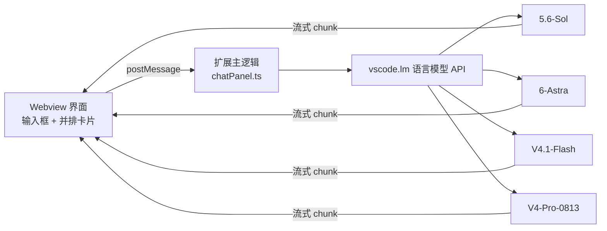
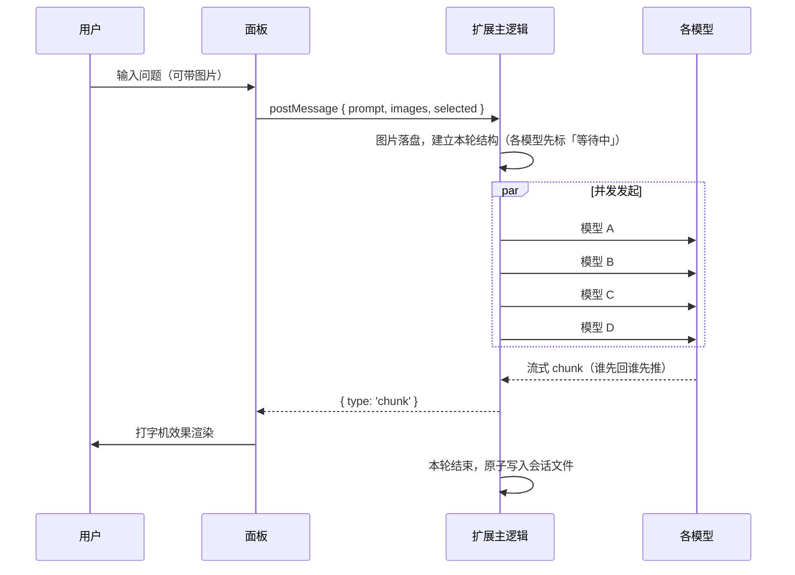

# 多模型对比对话（Multi-Model Compare）

一个 VS Code 扩展：在独立面板里把**同一个问题同时发给多个大模型**，并排对比它们的**流式回答**，支持多轮追问、图片输入与本地历史。

`v0.2.0` · 需求文档：`docs/多模型对比对话插件需求文档.md`

---

## 快速开始

如果扩展**已经装好**了，只要两步：

1. 按 `Cmd+Shift+P` 打开命令面板
2. 执行 **`多模型对比: 打开对比对话面板`**

然后在底部输入问题、回车发送即可。

> 还没装？跳到 [安装](#安装) 一节。

## 使用说明

### 界面布局

```
┌────────────────────────────────────────────────────────────────┐
│ 多模型对比对话                               [新建会话] [历史] │
├─ 显示结果 ─────────────────────────────────────────────────────┤
│ [x] Sol  [x] Astra  [x] Flash  [x] Pro              [全部显示] │
├─ 参与对比 ─────────────────────────────────────────────────────┤
│ [x] Sol  [x] Astra  [x] Flash  [x] Pro        [x] 只看我的模型 │
├──────────────────────────────────────────┬─────────────────────┤
│ 消息区                                   │ 历史会话            │
│                       解释一下快速排序   │ > 会话 A            │
│                                          │ > 会话 B            │
│ ┌──────────┐ ┌──────────┐ ┌──────────┐   │                     │
│ │ Sol      │ │ Astra    │ │ Flash    │   │                     │
│ │ [复制]   │ │ [复制]   │ │ [复制]   │   │                     │
│ │ 生成中   │ │ 生成中   │ │ 生成中   │   │                     │
│ └──────────┘ └──────────┘ └──────────┘   │                     │
│ 拖卡片右边缘可改宽度                     │                     │
├──────────────────────────────────────────┴─────────────────────┤
│ 输入问题…                                        [发送] [停止] │
└────────────────────────────────────────────────────────────────┘
```

| 区域 | 位置 | 作用 |
|------|------|------|
| 工具栏 | 顶部 | 会话标题、新建会话、收起/展开历史 |
| **显示结果** | 工具栏下方 | 控制已生成回答的**显隐**，不影响向哪些模型提问 |
| 参与对比 | 显示结果下方 | 勾选哪些模型参与提问 |
| 消息区 | 中部左侧 | 提问 + 每个模型一张回答卡片 |
| 历史会话 | 中部右侧 | 历史列表，点开可恢复并继续追问 |
| 输入区 | 底部 | 输入框 + 发送 / 停止 |

### 操作方式

| 操作 | 方式 |
|------|------|
| 发送问题 | 回车 |
| 换行 | `Shift` + 回车 |
| 给模型发图片 | `Cmd+V` 粘贴，或直接把图片拖进输入区 |
| 中断生成 | 点「停止」 |
| **复制某条回答** | 点卡片右上角的「复制」（复制的是 Markdown 原文） |
| **重新生成某条回答** | 最新一轮回答完成后，点对应卡片右上角的「重新生成」 |
| **调整卡片宽度** | 拖动卡片**右边缘**；**双击**手柄恢复默认宽度 |
| **隐藏某模型的回答** | 在「显示结果」里取消勾选；点「全部显示」一键恢复 |
| 放大图片 | 点缩略图；再点一下或按 `Esc` 关闭 |
| 打开回答里的链接 | 直接点击，会用系统浏览器打开 |
| 切换历史侧栏 | 点「历史」，或 `Cmd+Shift+P` → `多模型对比: 显示 / 隐藏历史会话` |
| 新建会话 | 点「新建会话」 |
| 删除历史会话 | 点会话右侧 `✕`，再点一次变成的「确认」（两段式，防误触） |

### 怎么读懂每张卡片

卡片标题栏：`模型名　[复制]　状态 · 耗时`

| 状态 | 含义 |
|------|------|
| 等待中 | 已排队，尚未开始 |
| 生成中 | 正在流式输出 |
| 完成 | 正常结束，后面跟着本次耗时（如 `完成 · 3.2s`） |
| 失败 | 出错，卡片底部会显示错误码与处理建议 |
| 已取消 | 点了「停止」后中断 |

若某张卡片下方出现 **“该模型不支持图片，本次已仅发送文本”**，说明这个模型收不了图片，
扩展已自动去掉图片重试并成功了。

## 特性

| 能力 | 说明 |
|------|------|
| 并排对比 | 每个模型一张卡片，横向排列，窗口变窄时可横向滚动 |
| 并发流式 | `Promise.all` 同时发起，各模型独立打字机输出，互不阻塞 |
| 上下文隔离 | 每个模型只回放**自己**答完的历史轮次，互不串扰 |
| **Markdown 渲染** | 标题、列表（含嵌套）、表格、代码块、引用、链接、分隔线、粗体/斜体/删除线 |
| **结果显隐开关** | 「显示结果」可临时隐藏不想看的回答，不影响已产生的数据 |
| **一键复制** | 每条回答右上角复制按钮，复制 Markdown 原文，带「已复制」反馈 |
| **卡片宽度可调** | 拖拽卡片右边缘改宽度，尺寸全局记住；双击恢复默认 |
| 图片输入 | 支持粘贴 / 拖入图片，最多 4 张、单张 ≤ 20MB |
| 历史会话 | 自动保存到本地，侧栏可点开恢复并继续追问 |
| 密钥安全 | 复用 VS Code 已配置的模型，扩展**不接触任何 API Key** |
| 只看我的模型 | 默认只显示自定义端点下的模型，不把 Copilot 自带的十几个一起列出来 |
| 容错 | 单个模型失败 / 超时 / 取消，不影响其它卡片 |
| 错误友好 | `NoPermissions` / `Blocked` / `NotFound` 会给出中文处理建议 |
| 同名区分 | 不同 vendor 下的同名模型会自动补上 vendor 后缀 |

## 设置项

| 设置 | 默认值 | 说明 |
|------|--------|------|
| `multiModelCompare.preferredVendors` | `["customendpoint"]` | 「我的模型」所在的 vendor，默认对应 `chatLanguageModels.json` 里的自定义端点 |
| `multiModelCompare.onlyPreferredVendors` | `true` | 只显示上面的 vendor 下的模型（界面开关与它同步） |
| `multiModelCompare.maxSelectedModels` | `8` | 默认勾选的数量上限，`0` 表示不限制 |

在设置界面搜索 `multiModelCompare` 即可找到。

> **为什么默认过滤掉其它模型**：`vscode.lm.selectChatModels({})` 会返回**全部**可用模型，
> 在启用 Copilot 的环境里往往有十几个（还可能有重名的）。若无条件全部列出并默认勾选，
> 一次提问会并发打到十几个模型上，既费额度又容易触发限流，对比视图也会变得难以阅读。
> 所以默认只显示 `customendpoint` 下的模型；需要对比 Copilot 原生模型时，
> 取消勾选「只看我的模型」即可。
>
> 注意：**隐藏即不可选**。取消勾选「只看我的模型」会把隐藏中的模型从选中列表里移除，
> 不会出现「看不见但仍在偷偷参与对比」的情况。

## 工作原理



扩展**不自己解析** `chatLanguageModels.json`、**不硬编码** API Key，而是通过 VS Code 的
Language Model API（`vscode.lm`）读取本机已配置的模型（含 `chatLanguageModels.json`
里注册的 Airouting / DeepSeek 自定义端点）。

这带来三个好处：

1. **不用管密钥** —— 直接用 VS Code 已有的登录态与模型配置；
2. **不用写各家的协议适配** —— 自定义端点、Copilot 原生模型同一套代码；
3. **自动拿到流式输出** —— `response.text` 本身就是 `AsyncIterable<string>`。

一次提问的完整流程：



## 数据存储

会话、图片与面板设置存在 VS Code 的全局存储目录下，**不在项目里**：

```
<VS Code globalStorage>/local.multi-model-compare/
├── settings.json               面板设置（卡片宽度等，全局生效）
├── sessions/<sessionId>.json   每个会话一个文件（先写 .tmp 再 rename，原子写入）
└── images/<uuid>.<ext>         图片二进制，被会话文件按文件名引用
```

macOS 上的完整路径：

```
~/Library/Application Support/Code/User/globalStorage/local.multi-model-compare/
```

> 会话文件里**只存图片文件名**，不存 base64，避免文件膨胀。
> 扩展启动时会清理没被任何会话引用的孤儿图片。

## 安装

有三种方式，按使用场景选：

### 方式一：本地安装（推荐，日常使用）

```bash
npm run install:local
```

先编译，再把运行期需要的文件（`package.json` / `out` / `media` / `README.md`，约 **170K**）
复制到 `~/.vscode/extensions/local.multi-model-compare-<version>/`。**无需下载任何东西。**

**装完之后必须完全退出并重启 VS Code**（`Cmd+Q` 再打开），扩展才会被加载。

之后就能在**任何窗口**里直接用。

改代码后重新生效：

```bash
npm run install:local                        # 重新编译 + 覆盖安装
```

再按 `Cmd+Shift+P` → `Developer: Reload Window` 即可。

**升级到新版本**：

```bash
npm run install:local   # 会自动移除旧版本目录，安装当前版本
```

然后 `Cmd+Q` 重启 VS Code。已保存的历史会话与卡片宽度**不会丢失** ——
它们存在 `globalStorage` 里，不随扩展目录变化。

卸载：

```bash
npm run uninstall:local
```

### 方式二：F5 调试宿主（开发阶段）

按 **F5**，选择「运行扩展（多模型对比对话）」。会弹出一个新的 VS Code 窗口
（标题带 `[扩展开发宿主]`），扩展装在里面。

> 这个窗口是**临时的**，关掉就没了，适合改代码时快速验证。

### 方式三：打包 .vsix（发给别人）

```bash
npm run package:vsix
```

会在 `dist/` 下生成两个文件：

| 文件 | 用途 |
|------|------|
| `multi-model-compare-<version>.vsix` | 扩展安装包（约 **47 KB**），发给对方 |
| `安装说明（先看这个）.md` | 面向非技术用户的图文说明，一起发 |

对方拿到后，任选一种安装：

- **双击** `.vsix` 文件
- 或在扩展面板右上角「···」→「从 VSIX 安装…」
- 或命令行 `code --install-extension multi-model-compare-<version>.vsix`

> **打包是零下载的**：`scripts/package-vsix.mjs` 直接手工构造 vsix
> （本质是个特定结构的 zip：`[Content_Types].xml` + `extension.vsixmanifest` + `extension/`）。
> 因此**不需要** `npx @vscode/vsce`（那个会下载几十 MB 的 npm 依赖），也不需要联网。

#### ⚠️ 发给别人前要知道的两件事

1. **对方必须自己配置模型**。扩展里**不包含**任何账号或 API Key ——
   它借用的是使用者自己 VS Code 里配好的模型（Copilot 订阅，或自定义端点）。
   对方没配的话，打开面板会提示「没有找到可用模型」。
   这一点已经在 `安装说明（先看这个）.md` 里写清楚了。
2. **对方的 VS Code 需要 ≥ 1.137.0**（`vscode.lm` 稳定 API 的要求）。
   版本不够时安装会提示不兼容。

### 三种方式对比

| | F5 调试宿主 | `install:local` | `.vsix` |
|---|---|---|---|
| 重启 VS Code 后还在 | ❌ 关掉就没了 | ✅ 一直在 | ✅ 一直在 |
| 改代码生效 | 重载窗口 | 重跑脚本 + 重载窗口 | 重新打包再装 |
| 需要下载 | 不需要 | 不需要 | 不需要 |
| 适合 | 开发调试 | **日常使用（自己）** | **分享给他人** |
| 会写入扩展清单 | 否 | 否 | 是（在扩展面板可见） |

> 安装脚本只会操作 `local.multi-model-compare-*` 这个前缀的目录，不会影响已安装的其它扩展。

## 开发

```bash
npm install
npm run compile       # 一次性编译
npm run watch         # 监听文件变化自动编译
npm test              # 离线冒烟测试（70 项断言）
npm run install:local # 编译 + 装到本机 ~/.vscode/extensions
npm run package:vsix  # 编译 + 打包 dist/*.vsix（零下载）
```

### 可用命令

在命令面板（`Cmd+Shift+P`）里搜索「多模型对比」：

| 命令 | 作用 |
|------|------|
| `多模型对比: 打开对比对话面板` | 打开主面板 |
| `多模型对比: 新建会话` | 清空当前会话重新开始 |
| `多模型对比: 显示 / 隐藏历史会话` | 切换**右侧**历史侧栏 |

### 测试

`npm test` 运行 `scripts/smoke-render.mjs`，直接加载 `media/markdown.js` 跑断言，重点验证：

- **XSS 防护** —— 模型返回的 `<script>`、``、`javascript:` 链接必须被挡住，
  在标题 / 列表 / 表格 / 引用 / 代码块等**每个位置**都测了一遍；
- **语法正确性** —— 标题、列表（含嵌套）、表格、代码块、行内代码、链接等渲染结构；
- **边界情况** —— 未闭合围栏、空字符串、单个反引号 / 井号 / 竖线不能抛异常。

### 界面预览（不用启动 VS Code）

`scripts/preview.html` 在普通浏览器里加载真实的 `style.css` / `markdown.js` / `main.js`，
用 mock 的 `acquireVsCodeApi` 模拟扩展消息，适合调样式时快速看效果：

```bash
open scripts/preview.html          # macOS
```

## 项目结构

```
├── src/
│   ├── extension.ts      # 入口：注册命令、监听模型与设置变化
│   ├── chatPanel.ts      # 核心：模型发现、并发流式请求、会话编排、Webview HTML
│   ├── store.ts          # 会话 / 图片 / 设置的本地持久化（原子写入 + 孤儿清理）
│   └── types.ts          # 共享类型
├── media/
│   ├── markdown.js       # Markdown 渲染器（零依赖，可单独测试）
│   ├── main.js           # Webview 前端逻辑（渲染、勾选、图片、历史、拖拽）
│   └── style.css         # 界面样式（跟随 VS Code 主题变量）
├── scripts/
│   ├── smoke-render.mjs  # 离线冒烟测试（npm test）
│   ├── install-local.mjs # 本地安装 / 卸载到 ~/.vscode/extensions
│   ├── package-vsix.mjs  # 手工打包 .vsix（零依赖，不用 vsce）
│   └── preview.html      # 开发用界面预览页（浏览器里直接看 UI）
├── docs/
│   ├── 多模型对比对话插件需求文档.md
│   └── 给朋友的安装说明.md    # 打包时复制到 dist/，随 vsix 一起发
├── dist/                 # 打包产物（npm run package:vsix）
├── .vscode/
│   ├── launch.json       # F5 调试配置
│   └── tasks.json        # compile / watch 任务
└── package.json          # 扩展清单（命令、设置、engines）
```

### 环境要求

| | 版本 |
|---|---|
| VS Code | `^1.137.0`（`vscode.lm` 稳定 API 所需） |
| Node.js | 建议 18+（本项目在 v24 上验证） |
| TypeScript | 5.x（devDependency，`npm install` 会自动装） |

## 已知限制与设计取舍

- **Markdown 渲染**：支持常用语法（标题 / 列表（含嵌套）/ 表格 / 代码块 / 引用 / 链接 /
  分隔线 / 粗体斜体删除线），但**不做语法高亮**。出于安全考虑不解析 HTML，
  所有原始 HTML 一律转义。超过 20000 字符的回答退化为纯文本渲染，避免重排卡顿。
- **卡片宽度改为手动**：为了支持拖拽宽度，卡片从「窗口变窄自动堆叠」改成横向排列 +
  横向滚动（滚动条常驻）。双击拖拽手柄可恢复单张卡片的默认宽度。
- **卡片高度不随内容拉伸**：高度由内容决定，上限 `60vh`，超出时卡片内纵向滚动。
- **图片支持探测**：`vscode.lm` 在"消费模型"这一侧**没有暴露**稳定的能力查询接口，
  因此无法提前得知某个模型是否支持图片。当前策略是：
  1. 若能读到能力信息且明确为 `false`，直接跳过图片并标注；
  2. 若读不到，则**带图请求一次**，失败后**自动去掉图片重试**，成功则标注
     "该模型不支持图片，本次已仅发送文本"。

  > 需求文档 TBD-03 原本写的是"自动跳过"，意图一致，但实现方式不同（代价是多一次失败请求）。

- **历史图片会随上下文一起重发**（对已确认不支持图片的模型会自动跳过），因此多轮长会话下
  token 消耗与延迟会上升。
- **未实现**：工具调用、编辑器代码上下文、模型参数调参、云同步、Marketplace 发布
  （详见需求文档第 7 节）。

## 排障

| 现象 | 处理 |
|------|------|
| 装完后命令面板搜不到命令 | 确认已**完全退出并重启** VS Code（不是只关窗口）。若仍没有，去扩展面板搜「多模型对比对话」看是否被禁用或标为不兼容 |
| 提示"没有找到可用模型" | 确认已登录 GitHub / 已授权语言模型；在命令面板执行 `管理语言模型`（Manage Language Models）检查自定义端点是否可用 |
| 模型列表里没有 Airouting / DeepSeek | 检查 `~/Library/Application Support/Code/User/chatLanguageModels.json` 配置是否有效，然后重开面板 |
| 只显示了 4 个模型，想看别的 | 取消勾选顶部「只看我的模型」 |
| 显示了一堆不认识的模型 | 勾上「只看我的模型」，或在设置里把 `onlyPreferredVendors` 设为 `true` |
| 勾着「只看我的模型」却显示了全部模型 | `preferredVendors` 里填的 vendor 下一个模型都没找到，已自动回退为显示全部；把该设置改成你自己的 vendor 名即可 |
| 名称重复的模型分不清 | 不同 vendor 下的同名模型会自动显示为 `名称 · vendor` |
| 卡片显示 `[NoPermissions]` 或 `[Blocked]` | 首次使用某个模型时 VS Code 会请求授权，按提示允许即可；企业策略也可能拦截 |
| 卡片显示 `[NotFound]` | 该模型已不存在或当前账号无权访问，检查端点配置 |
| 图片相关报错 | 该模型可能不支持视觉输入，重试时已自动降级为纯文本 |
| 历史会话不见了 | 会话存在 `globalStorage` 下，不会随项目目录移动；重装扩展也不会删 |

如果问题依旧，可以看扩展宿主日志定位：

```
~/Library/Application Support/Code/logs/<最新时间戳>/window<N>/exthost/exthost.log
```

搜 `multi-model-compare` 即可看到激活记录与报错。

## 版本历史

### v0.2.0（当前）

- 新增 **Markdown 渲染**（`media/markdown.js`，零依赖）：标题、列表（含嵌套）、表格、
  代码块、引用、链接、分隔线、粗体 / 斜体 / 删除线。**不做语法高亮**，
  且出于安全考虑不解析 HTML（一律转义）
- 新增 **「显示结果」开关**：可临时隐藏某个模型的回答，**不影响**请求发给谁，
  也**不删数据**；被隐藏时提供「全部显示（N 项已隐藏）」一键恢复
- 新增 **一键复制**：每条回答右上角复制按钮，复制 **Markdown 原文**，带「已复制」反馈
- 新增 **卡片宽度可拖拽**：拖卡片右边缘改宽度（只调宽、不调高），全局记住；
  **双击手柄**恢复该卡片默认宽度
- 界面调整：**历史会话列表移到右侧**
- 修复：代码块撑破卡片宽度、语言标签悬在代码块外、横向滚动条不可见
- 工程：新增 `npm run package:vsix`（**零下载**手工打包，不用 `vsce`）、
  `scripts/preview.html`（浏览器里预览 UI）、配套的《给朋友的安装说明》
- 修复：「只看我的模型」的 vendor 过滤落空、回退显示全部模型时，
  复选框状态与实际不符且无任何提示 —— 现在会明确告知原因

### v0.1.0

- 首个版本：并排对比、并发流式输出、上下文隔离、图片输入、本地历史会话、
  「只看我的模型」过滤、错误码中文化、同名模型区分

## 后续可做

需求文档第 7 节明确列为**本版不做**的部分：

- 编辑器代码上下文（选中代码作为输入）
- 工具调用（tool calling）
- 模型参数调参界面（temperature 等）
- 多账号 / 多人协作 / 云同步
- 其它模型来源（Ollama 本地模型等）
- 发布到 Marketplace

另外这些是实现过程中冒出来的、可以考虑的改进点：

- 代码语法高亮（需引入额外库，会破坏零构建）
- 同一问题的多次回答做 diff 对比
- 导出对比结果为 Markdown / CSV
- 卡片支持折叠、置顶、只显示差异
- 「重置所有卡片宽度」的入口（目前只能逐张双击手柄）
- 单模型单独重试（现在只能整轮重发）
